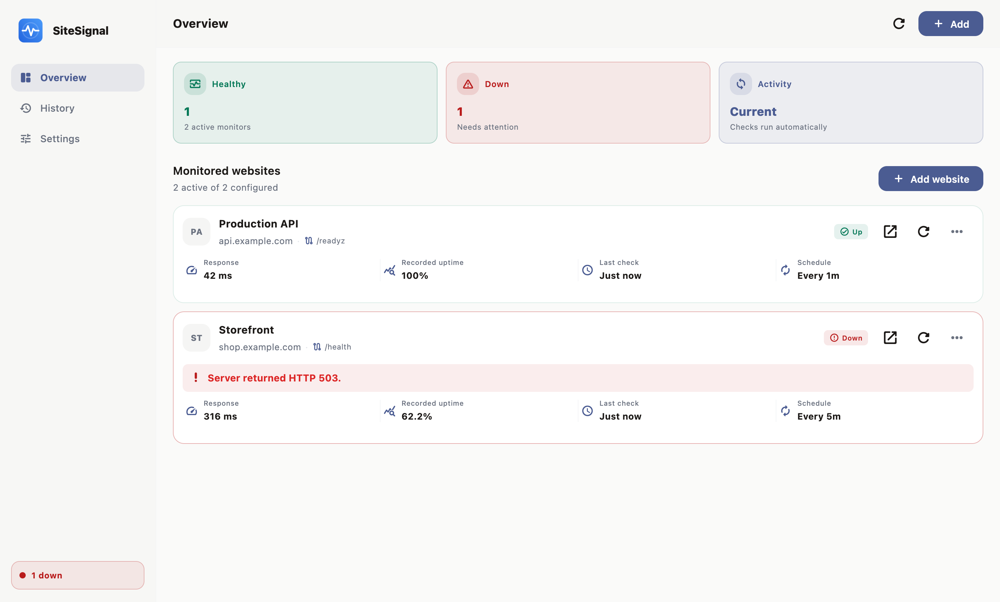
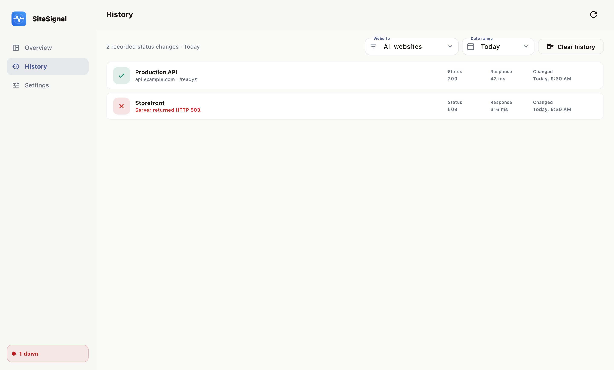
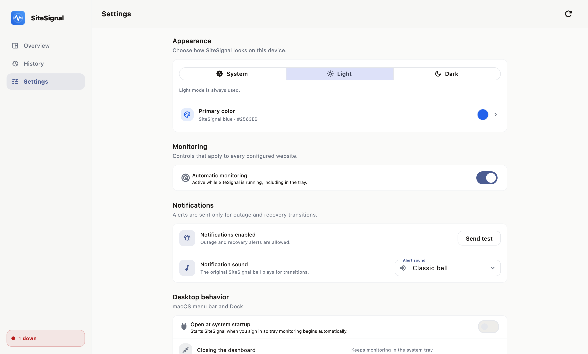
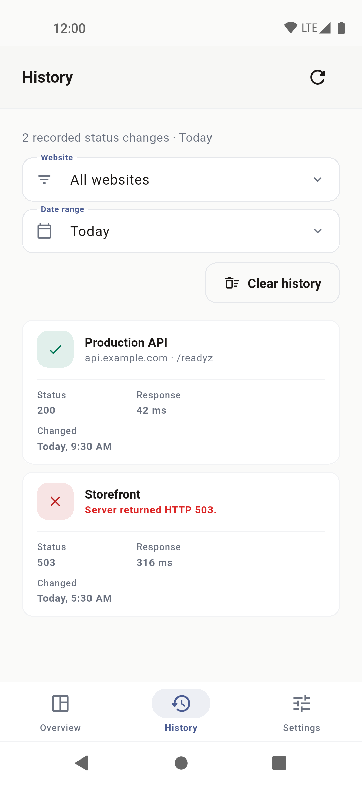
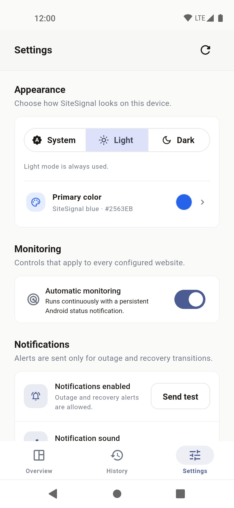

# SiteSignal

<br>

<p align="center">
  
  <br>
  <strong>Status:</strong> Active development
  <br>
  <strong>Version:</strong> 1.0.0
  <br>
  <a href="https://github.com/mukulkaushish/sitesignal/releases"><strong>Download</strong></a>
  ·
  <a href="https://github.com/mukulkaushish/sitesignal/actions">Builds</a>
  ·
  <a href="https://github.com/mukulkaushish/sitesignal/commits/main">Commits</a>
</p>

<p align="center">
  <a href="https://github.com/mukulkaushish/sitesignal/actions/workflows/ci.yml"></a>
  <a href="https://github.com/mukulkaushish/sitesignal/actions/workflows/release.yml"></a>
</p>

SiteSignal is a free website health monitor for your own devices. Add a website,
choose how often to check it, and receive a native notification when it goes
down or comes back online.

> [!NOTE]
> Your URLs, settings, and history stay on your device. SiteSignal has no
> account, cloud server, analytics, advertising, or subscription.

### Table of Contents

[Features](#features) · [Screenshots](#screenshots) ·
[Platforms](#supported-platforms) · [Download](#getting-sitesignal) ·
[Privacy](#privacy) · [Development](#development) · [License](#license)

<br>

## Features

### Monitoring

- **Multiple websites · Automatic checks · Manual checks · Health endpoint discovery**
- Add a base URL and let SiteSignal try safe same-origin paths such as
  `/health`, `/healthz`, `/readyz`, `/api/health`, and `/status`.
- Choose a check interval from 15 seconds to 1 hour.
- See response time, HTTP status, recorded uptime, and recent state changes.
- Detect device internet problems without marking every website as down.

### Notifications

- Receive an alert only when a website changes state, which avoids repeat
  notification spam.
- Choose Classic bell, Bright chime, Soft pulse, Beacon, the system sound, or
  silent notifications.
- Hear an audible sound preview as soon as you select it.
- Send a test notification with the currently selected sound.

### App controls

- Filter history by website and date range.
- Pause, resume, edit, disable, or remove a monitor.
- Use System, Light, or Dark appearance and choose an accent color.
- Keep monitoring from the desktop tray or Android foreground service.
- Store all configuration and transition history in a local SQLite database.

## Screenshots

The screenshots below are always visible, use light mode, and contain only safe
`example.com` demo data. Click an image to open the full-resolution version.

### macOS

| Overview | History | Settings |
| --- | --- | --- |
| [](docs/screenshots/macos-overview-light.png) | [](docs/screenshots/macos-history-light.png) | [](docs/screenshots/macos-settings-light.png) |

### Android

| Overview | History | Settings |
| --- | --- | --- |
| <a href="docs/screenshots/android-overview-light.png"></a> | <a href="docs/screenshots/android-history-light.png"></a> | <a href="docs/screenshots/android-settings-light.png"></a> |

Android screenshots are captured at 1080×2340 with the real status and
navigation bars. macOS screenshots are captured at 2× resolution.

## Supported platforms

| Platform | App behavior | Distribution |
| --- | --- | --- |
| macOS | Desktop window, menu bar, native alerts | ARM64 and x86_64 ZIP |
| Linux | Desktop window, system tray, native alerts | ARM64 and x86_64 archive |
| Windows | Desktop window, system tray, native alerts | ARM64 and x86_64 ZIP/MSIX |
| Android | Responsive app, foreground monitoring, native alerts | ARMv7, ARM64, and x86_64 APK |
| iOS | Source kept for possible future work | Not built or published |

> [!IMPORTANT]
> SiteSignal currently builds and publishes macOS, Linux, Windows, and Android
> only. The release pipeline does not create an iOS artifact.

Desktop builds keep monitoring in the tray when the window closes. Android
uses a visible foreground service because the operating system limits hidden
background work.

## Getting SiteSignal

### GitHub Releases

Published versions are available on the
[Releases page](https://github.com/mukulkaushish/sitesignal/releases). Release
files are currently unsigned, development signed, or ad-hoc signed, so your
operating system may show a warning.

### Free CI builds

Every successful [CI run](https://github.com/mukulkaushish/sitesignal/actions/workflows/ci.yml)
provides short-lived test artifacts:

- macOS ARM64 ZIP
- Android ARMv7, ARM64, and x86_64 APKs
- Test coverage
- The latest six-image screenshot collection

Open a successful run and download the required file from its **Artifacts**
section. See [BUILD.md](BUILD.md) for local release commands and platform
requirements.

## How it works

1. Add a website and choose a check interval.
2. SiteSignal checks the base address and safe same-origin health endpoints.
3. A `200–299` response is healthy. Timeouts, connection errors, and other HTTP
   responses are failures.
4. The first result creates a baseline. Later state changes create an outage or
   recovery notification.
5. Configuration and transition history are saved locally.

SiteSignal checks from one device and one network. It is useful for personal
sites, side projects, homelabs, and internal tools. It is not a replacement for
multi-region monitoring or a public status page.

## Privacy

> [!TIP]
> SiteSignal does not send data to a SiteSignal server because no such server
> exists. Network requests go only to websites you configure and to bounded
> connectivity-check endpoints used to confirm internet access.

Do not put private URLs, credentials, signing keys, personal screenshots, or
real monitoring data in issues or pull requests. Read [PRIVACY.md](PRIVACY.md)
and [SECURITY.md](SECURITY.md) for details.

## Development

Install Flutter `3.44.7` and the toolchain for your platform, then run:

```bash
git clone https://github.com/mukulkaushish/sitesignal.git
cd sitesignal
flutter pub get
flutter run
```

Run the complete local checks with:

```bash
dart format --output=none --set-exit-if-changed lib test integration_test tool
bash -n tool/*.sh
dart run tool/check_code_rules.dart
flutter analyze
flutter test
```

This public repository uses standard GitHub-hosted runners. CI checks the code,
runs all tests, builds macOS ARM64 and Android packages, exercises the Android
feature flow, and uploads fresh screenshots. The manual or tag-based release
workflow builds Linux, macOS, Windows, and Android without creating an iOS
artifact.

For screenshot commands and the complete native release matrix, read
[BUILD.md](BUILD.md).

## Contributing

Contributions are welcome. Read [CONTRIBUTING.md](CONTRIBUTING.md) and the
[Code of Conduct](CODE_OF_CONDUCT.md) before opening a pull request. Use only
sanitized `example.com` data in screenshots, tests, logs, and issues.

## License

SiteSignal is open source under the [MIT License](LICENSE). You may use,
modify, and share it under the license terms.
