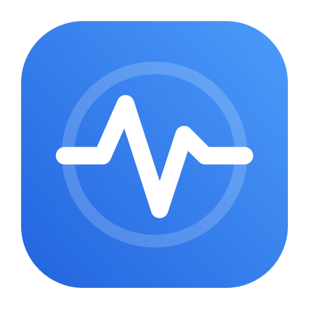
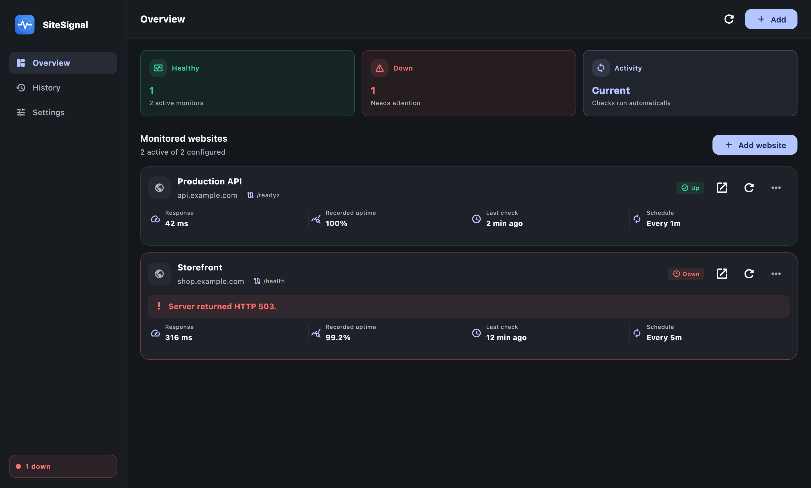
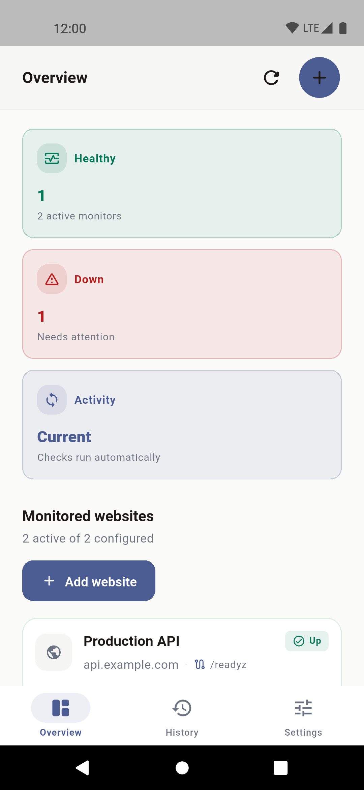
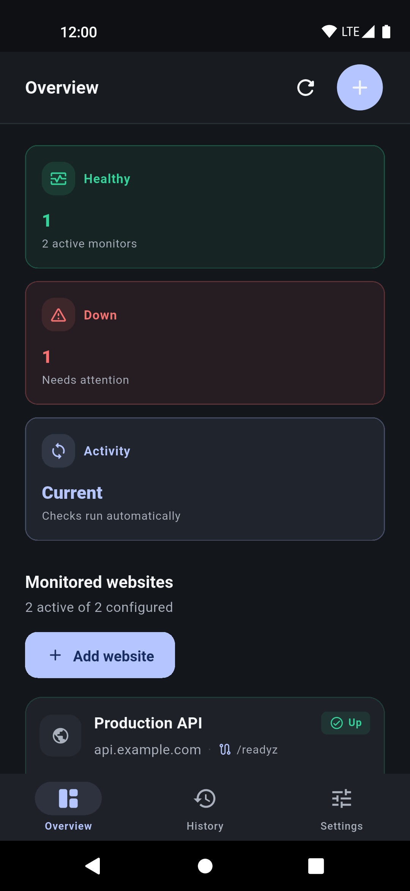
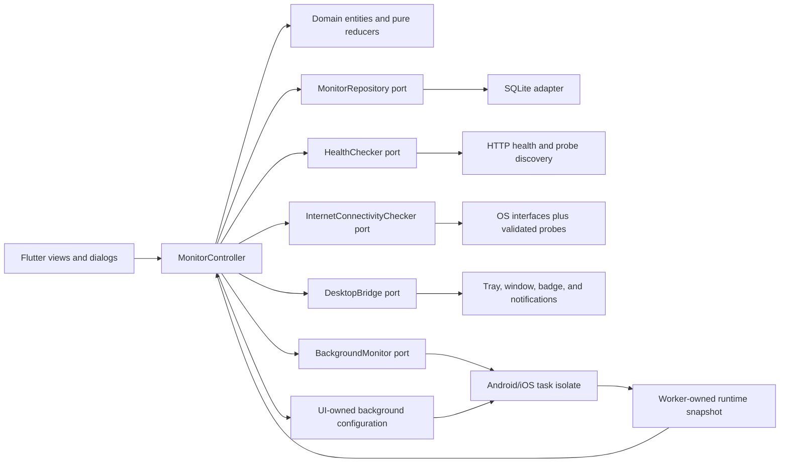

<p align="center">
  
</p>

# SiteSignal

[](https://github.com/mukulkaushish/sitesignal/actions/workflows/ci.yml)
[](https://github.com/mukulkaushish/sitesignal/actions/workflows/release.yml)

> Know when a website becomes unavailable—and when it recovers—without sending
> your monitoring data to a hosted service.

SiteSignal is a local-first, cross-platform website health monitor for macOS,
Linux, Windows, and Android. Add a base URL, choose a check interval, and
receive a native notification when its health changes. Desktop builds keep
working from the menu bar or system tray, while Android uses a visible
foreground service. The iOS source remains in the repository for future work,
but iOS build creation and distribution are intentionally disabled.

There is no SiteSignal account, hosted backend, analytics SDK, advertising, or
subscription. Monitor configuration and history stay in a local SQLite
database on the device running the app.

[Walkthrough](#feature-walkthrough) · [Quick start](#quick-start) · [Features](#what-it-includes) ·
[Platform behavior](#platform-behavior) · [Architecture](#architecture) ·
[Contributing](CONTRIBUTING.md) · [Privacy](PRIVACY.md) ·
[Security](SECURITY.md)

## Feature walkthrough

**[▶ Watch the complete Android walkthrough (MP4, 1080×2340)](docs/walkthrough/sitesignal-android.mp4)**

The 70-second native recording uses sanitized `example.com` fixtures and walks
through the dashboard and health details, adding a monitor, interval selection,
disable/enable/edit/remove actions, manual checks, History filters, light and
dark appearance, accent colors, automatic monitoring, custom and system
notification sounds, the test notification action, and Android background
behavior. It includes the real Android status and navigation bars.

The walkthrough is driven by `integration_test/walkthrough_test.dart`, so the
same feature sequence can be rerun instead of relying on an unreproducible
manual recording.

<details>
<summary>High-resolution CI visual references</summary>

CI also regenerates native-engine light and dark references after every
successful `main` build and rejects pull requests whose committed images are
stale. These remain regression assets; the walkthrough above is the primary
product tour.

| macOS light | macOS dark |
| --- | --- |
|  |  |

| Android light | Android dark |
| --- | --- |
|  |  |

</details>

## At a glance

| | SiteSignal |
| --- | --- |
| Best for | Personal sites, side projects, homelabs, internal tools, and small deployments |
| Monitoring model | Local checks from the device where SiteSignal is running |
| Health detection | Base-origin checks plus bounded same-origin health-endpoint discovery |
| Alerts | Native outage and recovery notifications, emitted only on real state changes |
| Storage | Local SQLite database with bounded per-site transition history |
| Privacy | No account, cloud sync, analytics, advertising, or remote SiteSignal server |
| Enabled distributions | macOS, Linux, Windows, and Android |

SiteSignal complements rather than replaces geographically distributed hosted
monitoring. Because checks originate from one local device, it is best when a
private, understandable monitor matters more than multi-region verification or
a public status page.

## What it includes

- Multiple website monitors from base URLs only
- Automatic same-origin probe discovery across `/`, `/health`, `/healthz`,
  `/readyz`, `/api/health`, `/actuator/health`, and `/status`
- Remembered healthy probes, with automatic re-discovery after a probe fails
- Responsive interval choices from 15 seconds to 1 hour
- Manual checks from the dashboard or desktop tray menu
- Native notifications on macOS, Linux, Windows, Android, and iOS
- Brief evidence-first alerts, such as **🔴 Example is down** with **HTTP 503**
- Six sound choices: Classic bell, Bright chime, Soft pulse, Beacon, the
  operating-system default, or silent delivery; every audible choice previews
  as soon as it is selected
- One live notification per site: each state change replaces only that site's
  previous alert while other sites remain visible
- Down-site counts on supported app icons, the macOS Dock, and notifications
- Notifications only when state changes, avoiding repeated alert noise
- Device-wide connectivity handling: no network, captive portal, Wi-Fi without
  internet, and mobile-data loss pause checks without marking websites down
- One replace-in-place connectivity alert while offline and one recovery alert;
  SiteSignal never emits one false outage per configured website
- Per-site favicon discovery with a built-in fallback icon
- Per-site response time, HTTP status, time-weighted uptime, and transition bar
- Up to 100 persisted initial/status-transition records per site; repeated
  states update the latest check without adding history
- History defaults to **Today**, with **Yesterday**, **3 days**, **7 days**, and
  **All** date filters
- Human-readable timestamps such as **Just now**, **5 min ago**, and
  **Yesterday, 6:05 PM**
- SQLite storage for settings, URLs, favicons, discovered probes, and history
- Persisted System, Light, and Dark appearance choices, with a layered
  graphite dark palette and semantic contrast
- Native system typography on every platform
- One generated SiteSignal app icon across in-app, Android adaptive/monochrome,
  iOS, macOS, Windows, web, and Linux surfaces
- A customizable primary color with SiteSignal blue (`#2563EB`) as the default
- Pause, resume, edit, disable, and remove controls
- A dynamic desktop tray icon for healthy, down, checking, and paused states
- One visibility-aware **Open Dashboard** or **Hide Dashboard** desktop action
- A desktop dashboard that hides instead of quitting when its window is closed
- Optional launch at system startup on macOS 13+, Linux, and Windows so tray
  monitoring begins after sign-in
- Responsive navigation and controls for phone-sized screens
- Single-instance activation on Linux and Windows

All monitor configuration and history remain in a local SQLite database on the
device and are restored after SiteSignal restarts. Release bundles include the
SQLite runtime; Linux users do not need `libsqlite3-dev`.

## Health semantics

- Final HTTP status `200–299`: potentially up
- Final HTTP status `300–599`: down (valid redirects are followed first)
- HTML placeholder, infrastructure-error, and interstitial pages are down even
  if a misconfigured origin returns HTTP 200
- DNS, TLS, connection, and timeout errors: down only after independent
  connectivity checks confirm that the device still has internet access
- Request timeout: 10 seconds
- Redirect limit: 5
- The normalized base origin is tried first. If it returns an unhealthy HTTP
  response, the bounded conventional probe set is checked on the same origin.
- Discovered probe paths must return a non-HTML response. This prevents a
  single-page app's catch-all document from masquerading as a health endpoint.
- Liveness-only endpoints are intentionally excluded: a process can be alive
  while not ready to serve users.
- Once a healthy probe is found, later checks use it first. A failed remembered
  probe triggers re-discovery before SiteSignal records an outage.
- DNS, TLS, and connection failures stop discovery because alternate paths
  cannot repair an unreachable origin.
- The first result establishes a baseline and does not send an alert
- Later `up → down` and `down → up` transitions send alerts
- Only the baseline and real transitions enter History. Every probe still
  updates the latest response time and scheduler timestamp.

Before a due check, SiteSignal combines the operating system's active-network
signal with small validated probes. A Wi-Fi association alone is not treated as
internet access. Probe traffic is limited to due-check and offline-recovery
windows and uses Android's connectivity endpoint and Microsoft's NCSI endpoint;
no monitor URLs or history are sent to either service.

SiteSignal is not a remote monitoring service. Desktop checks run while the
process is running, including while its window is hidden in the tray. Android
checks run in a foreground service while automatic monitoring is enabled and at
least one site is active; the required persistent notification makes that work
visible and the service can resume after reboot or app update. Force-stopping
the app disables this until the user opens it again.

A sleeping laptop cannot make network requests. SiteSignal detects the clock
gap on wake, discards any request that straddled sleep, and performs one overdue
check per site instead of replaying every missed interval or reporting a false
outage.

iOS background refresh is best effort: iOS chooses the schedule, typically
offering a short execution window around every 15 minutes or later. It is not
suitable for guaranteed 15-second monitoring, does not restart at boot, and
stops after the user force-quits the app. Overdue checks run on return. No local
app can check while a device is powered off; guaranteed uptime monitoring
requires a remote service.

## Requirements

- Flutter 3.44.7 (the CI-pinned version) or newer within the 3.44 stable line
- Dart 3.12 or newer
- One supported Flutter target: macOS 10.15+, Linux with GTK 3, Windows 10+,
  Android, or iOS

The app runs on macOS 10.15+, while its **Open at system startup** control uses
Apple's modern login-item API and is available on macOS 13+.

## Platform behavior

| Platform | Automatic monitoring | Important detail |
| --- | --- | --- |
| macOS | Runs while SiteSignal is open or hidden in the menu bar | Closing the dashboard hides it; quitting stops checks. Launch at login requires macOS 13+. |
| Linux | Runs while SiteSignal is open or hidden in the system tray | Some desktop environments require AppIndicator support for the tray icon. |
| Windows | Runs while SiteSignal is open or hidden in the system tray | Packaged MSIX builds can use bundled notification audio; portable builds use the Windows default for delivered notifications. |
| Android | Runs in a visible foreground service while monitoring is enabled | Force-stopping the app prevents background work until it is opened again. |
| iOS | Uses system-scheduled background refresh and checks overdue sites on resume | Scheduling is controlled by iOS and is not suitable for guaranteed short intervals. |

Desktop devices cannot check while asleep or powered off. SiteSignal detects a
sleep gap and performs one overdue check after wake instead of replaying every
missed interval or reporting a sleep-related false outage.

On Debian or Ubuntu, install Flutter's desktop build dependencies and the tray
indicator development package:

```bash
sudo apt-get update
sudo apt-get install \
  clang cmake ninja-build pkg-config libgtk-3-dev liblzma-dev \
  libstdc++-12-dev libayatana-appindicator3-dev
```

Some plain GNOME installations require the
[AppIndicator extension](https://extensions.gnome.org/extension/615/appindicator-support/)
before tray icons are visible. Ubuntu enables compatible indicator support by
default.

## Quick start

```bash
flutter pub get
flutter run -d macos
```

Replace `macos` with an attached target such as `linux`, `windows`, an Android
device ID, or an iOS device ID. For example, on Linux:

```bash
flutter pub get
flutter run -d linux
```

## Build releases

Build every release supported by the current machine:

```bash
flutter pub get
dart run tool/build_all_platforms.dart
```

The command detects the host. macOS builds macOS and Android; Linux builds Linux
and Android; Windows builds Windows and Android. Select one target or
architecture when needed:

```bash
dart run tool/build_all_platforms.dart --target macos --arch all
dart run tool/build_all_platforms.dart --target linux --arch x86_64
dart run tool/build_all_platforms.dart --target windows --arch arm64
dart run tool/build_all_platforms.dart --target android --arch all
```

Run `dart run tool/build_all_platforms.dart --help` for all options. The release
matrix is:

| Platform | Release architectures | Package |
| --- | --- | --- |
| macOS | ARM64, x86_64 | Architecture-specific `.zip` |
| Linux | ARM64, x86_64 | Architecture-specific `.tar.gz` |
| Windows | ARM64, x86_64 | Architecture-specific `.zip` and `.msix` |
| Android | ARMv7, ARM64, x86_64 | Split APK per ABI |

Linux and Windows desktop builds must run on a native host matching the target
architecture. Normal CI keeps feedback fast by building ARM macOS and all
Android APK architectures. Run **Actions → Release → Run workflow** for the
complete enabled native matrix, or push a `v*` tag to build it and publish a
checksummed GitHub prerelease. iOS distribution is intentionally disabled and
no iOS artifact is created by the build script or workflows.

Artifacts are written below `build/distributions/<platform>/<architecture>/`.
Windows MSIX packages enable bundled sounds for delivered notifications under
package identity. The portable ZIP uses the Windows default for delivered
notifications, while sound-picker and test-notification previews still play the
chosen bundled tone in-app.

Flutter's normal macOS output contains both Apple-silicon and Intel code. The
packaging script builds once, thins both requested releases, then signs and
compresses them separately.
On the verified Apple-silicon build it is about 23 MiB installed and 9.8 MiB
zipped, down from the universal bundle. Release packages include their SQLite
runtime so storage works without a host development package.

The desktop application identifier is `dev.sitesignal.app` everywhere:
product, executable, package, and artifact names, plus the macOS/Linux
bundle identifiers. Older installs that still have a `sitotify.sqlite3`
database from before the rename get it copied non-destructively to
`sitesignal.sqlite3` on first launch of the renamed build. The macOS
packaging script uses an ad-hoc local signature while preserving sandbox
and network entitlements; public releases still need a Developer ID
signature and notarization.

Linux archives include a freedesktop `.desktop` entry and 512 px icon under
their `share/` directory. A relocatable tar archive cannot register those files
automatically; a distributor should install them into the matching system or
per-user XDG data directories and set `Exec` to the installed executable.

## Verify changes

```bash
dart format --output=none --set-exit-if-changed lib test integration_test tool
dart run tool/check_code_rules.dart
flutter analyze
flutter test
```

The automated checks cover base-origin validation and normalization, automatic
probe discovery, placeholder response classification, favicon discovery,
SQLite restart persistence/migration, transition-only history and
notifications, background snapshot round-tripping, no-network and captive
connectivity classification, alert deduplication, theme persistence, interval
selection, retention limits, pause state, duplicate detection, every history
date filter, minimum-window layouts, phone-sized navigation, and the add-monitor
flow, including a 200% system-text layout. CI pins Flutter, gates packaging on
workflow syntax, format, shell syntax, repository rules, analyzer results, and
the complete test suite, then builds ARM macOS and Android while reproducing all
four repository screenshots and the Android feature walkthrough. The release
workflow expands that gate to Linux, macOS, and Windows x86_64/ARM64 plus
Android ARMv7/ARM64/x86_64. It does not create an iOS distribution.

## Architecture

SiteSignal follows a feature-first, ports-and-adapters structure. Domain types
contain platform-neutral policy; data adapters own HTTP, SQLite, plugins, and OS
APIs; presentation owns Flutter state and rendering. `main.dart` is the
composition root.



The main data path is:

1. A manual action, scheduler tick, resume, or mobile task uses the shared
   `MonitoringPolicy` to determine what is due.
2. One shared connectivity assessment and `ConnectivityPolicy` validate
   internet access without turning a device outage into website incidents.
3. Up to four sites are checked concurrently; each site itself is coalesced.
4. The pure health reducer updates the latest observation and transition-only
   history.
5. State is serialized to SQLite and the background boundary.
6. A concise notification is sent only for a known-state transition.

The background boundary has one writer per concern: the main isolate writes
configuration and the worker writes runtime observations. A pure merge reducer
accepts newer results while preserving current site membership, URLs, enable
state, pause state, and sound selection.

### Project map

- `lib/app` — application theme wiring and the responsive adaptive shell
- `lib/core/theme` — shared color, typography, spacing, and component tokens
- `lib/core/async` — bounded fan-out and failure-contained serial task queues
- `lib/core/widgets` — shared brand and structural widgets
- `lib/features/monitoring/domain` — monitor entities and storage/check/platform
  contracts, shared scheduling/connectivity/fleet policy, incident copy, and
  pure merge/reducer policy
- `lib/features/monitoring/data` — HTTP probe discovery, bundled SQLite
  persistence, internet validation, background monitoring, and native platform
  integration
- `lib/features/monitoring/presentation` — scheduler/controller, overview,
  history, settings, and monitor editor
- `tool/generate_tray_icons.swift` — one reproducible source for tray, in-app,
  Android, Apple, Windows, web, and Linux artwork
- `tool/build_all_platforms.dart` — cross-platform release build orchestrator
- `tool/capture_repository_screenshots.sh` — native macOS and Android light/dark
  screenshot capture used locally and in CI
- `tool/capture_feature_walkthrough.sh` — records the reproducible Android
  feature tour with native system bars
- `tool/package_macos_minimal.sh` — split-symbol, architecture-specific macOS
  release packaging
- `tool/package_linux_release.sh` — relocatable, compressed Linux release
  packaging
- `tool/package_windows_release.ps1` — verified Windows x86_64/ARM64 ZIP and
  MSIX packaging
- `tool/check_code_rules.dart` — repository guard against postfix non-null
  assertions, drifting package/brand metadata, missing generated assets, and
  mismatched Flutter/Android sound copies
- `test` — unit, persistence, controller, network, and responsive widget tests
- `integration_test` — device-driven, end-to-end feature walkthrough

### Architecture invariants

Contributors should preserve these rules:

- A device connectivity problem never changes a site's status or history.
- The first site result is a baseline; only later state transitions alert.
- One site check and one connectivity assessment may be in flight at a time for
  their respective keys; bulk network work is bounded.
- Mutable configuration and lifecycle generations are revalidated after every
  asynchronous boundary before a result is applied.
- A transition is persisted before its notification is delivered.
- Notification identifiers are deterministic and stable per site or device
  connectivity slot.
- Connectivity interface-change alerts have one active owner: the mobile
  worker when it owns scheduling, otherwise the main controller.
- Site history contains the baseline and status changes only; `lastCheck`
  contains the newest repeated observation.
- The main isolate owns background configuration; the worker owns background
  runtime observations.
- Postfix non-null assertions are forbidden. Prefer promotion, patterns,
  null-aware access, and guarded branches.
- Appearance-only changes use a settings-only SQLite write and do not rewrite
  monitor history or wake the background worker.
- Fleet counts and coarse status come from `MonitorFleetSummary`; overview,
  sidebar, tray, and service surfaces only specialize their copy.
- Persistence, background synchronization, and menu updates use independent
  serial queues, and shutdown drains each queue before adapters close.

## Documentation

- [Build and platform guide](BUILD.md) — prerequisites, packaging, signing, and
  platform-specific smoke tests
- [Contributing guide](CONTRIBUTING.md) — development workflow, architecture
  guardrails, and pull-request checklist
- [Privacy details](PRIVACY.md) — local data, network requests, permissions, and
  deletion
- [Security policy](SECURITY.md) — supported versions and private reporting
- [Changelog](CHANGELOG.md) — user-visible release history
- [Repository publishing guide](docs/REPOSITORY_SETUP.md) — GitHub description,
  topics, settings, and release checklist for maintainers

## Contributing

Contributions are welcome. Read [CONTRIBUTING.md](CONTRIBUTING.md) and the
[Code of Conduct](CODE_OF_CONDUCT.md) before opening an issue or pull request.
Behavior changes should include regression coverage, and all four commands in
[Verify changes](#verify-changes) must pass before review.

## Privacy and security

SiteSignal has no hosted backend, account system, analytics, or advertising.
It makes requests only to configured sites, their same-origin resources, and
two small public reachability endpoints used to avoid false outage reports when
the device itself is offline. See [PRIVACY.md](PRIVACY.md) for the complete data
flow and [SECURITY.md](SECURITY.md) for responsible vulnerability reporting.

## Licensing note

This repository still needs a project-level `LICENSE` chosen by its owner
before it is published as open source. The
[repository publishing guide](docs/REPOSITORY_SETUP.md#choose-a-license)
summarizes the decision without selecting legal terms on the owner's behalf.

## Reference documentation

The platform choices follow the current
[Flutter desktop guidance](https://docs.flutter.dev/platform-integration/desktop),
[Flutter networking guidance](https://docs.flutter.dev/data-and-backend/networking),
[Android validated-network guidance](https://developer.android.com/develop/connectivity/network-ops/reading-network-state),
[Android foreground-service guidance](https://developer.android.com/develop/background-work/services/fgs),
[Apple Background Tasks guidance](https://developer.apple.com/documentation/backgroundtasks/bgapprefreshtask),
Apple's [notification guidance](https://developer.apple.com/design/human-interface-guidelines/notifications),
Android's [notification guidance](https://developer.android.com/design/ui/mobile/guides/home-screen/notifications),
Apple's [Dark Mode guidance](https://developer.apple.com/design/human-interface-guidelines/dark-mode),
Apple's [menu bar item API](https://developer.apple.com/documentation/appkit/nsstatusitem),
the
[Kubernetes health endpoint guidance](https://kubernetes.io/docs/reference/using-api/health-checks/),
[ASP.NET Core health-check guidance](https://learn.microsoft.com/en-us/aspnet/core/host-and-deploy/health-checks),
[Spring Boot Actuator health API](https://docs.spring.io/spring-boot/api/rest/actuator/health.html),
[sqflite desktop guidance](https://pub.dev/packages/sqflite_common_ffi), and the
[Desktop Notifications Specification](https://specifications.freedesktop.org/notification/latest-single/).
